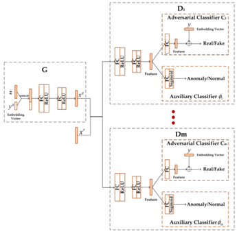

# EAL-GAN 模型描述

EAL-GAN 模型由一个生成器和多个集成的判别器所构成，通过生成器生成伪样本有助于克服异常检测任务中常见的类别不平衡问题。每个判别器由两部分构成：一个对抗分类器用于判定样本是真实的还是生成的，一个辅助分类器用于判定样本是正常的还是异常的,；多个辨别器学习率不同，相互竞争，这样的构造有助于稳定 GAN 训练并提高最终性能。最终推理时只需使用集成的辅助分类器投票判断样本是否为异常即可。

详见论文:

Chen Z, Duan J, Kang L, et al. Supervised anomaly detection via conditional generative adversarial network and ensemble active learning[J]. arXiv preprint arXiv:2104.11952, 2021.

论文链接：[https://arxiv.org/abs/2104.11952v1](https://arxiv.org/abs/2104.11952v1)。

# 数据集

|Dataset (数据集名称)|Number of Instances (实例个数)|Feature Dimension (特征维度)|Anomaly Ratio (异常比例)|
| ----------------------| --------------------------------| ------------------------------| --------------------------|
|Lympho|148|18|4.05%|
|Glass|214|9|4.21%|
|Ionosphere|351|33|35.90%|
|Arrhythmia|452|274|14.60%|
|Pima|768|8|34.90%|
|Vowels|1456|12|3.43%|
|Letter|1600|32|6.25%|
|Cardio|1831|21|9.61%|
|Musk|3062|166|3.17%|
|Optdigits|5216|64|2.88%|
|Satimage2|5803|36|1.22%|
|Satellite|6435|36|31.64%|
|Pendigits|6870|16|2.27%|
|Annthyroid|7200|21|7.42%|
|Mnist|7603|100|9.21%|
|Shuttle|49097|9|7.15%|

本项目选取了异常检测任务中16个常见的数据集进行了实验，这些数据集涵盖了多种不同的应用场景并且在大小、特征维度、异常比例等特性上多样性都较高，能够较为全面地对模型的性能进行评估。训练时按照 6：2：2的 比例随机划分了训练集、验证集和测试集。

# 环境要求

* 硬件

  使用Ascend、GPU或者CPU来搭建硬件环境
* 框架

  [MindSpore](https://www.mindspore.cn/install/en)
* 如需查看详情，请参见如下资源：

  [MindSpore教程](https://www.mindspore.cn/tutorials/zh-CN/r1.3/index.html)

  [MindSpore Python API](https://www.mindspore.cn/docs/api/zh-CN/r1.3/index.html)

# 项目结构说明

## 数据文件

下载处理好的 mat 文件即可，下载连接见下；将下载好的数据放在EAL-GAN/data 下

> Lympho：http://odds.cs.stonybrook.edu/lympho/
>
> Glass:  http://odds.cs.stonybrook.edu/glass-data/
>
> Ionosphere:  http://odds.cs.stonybrook.edu/ionosphere-dataset/
>
> Arrhythmia:  http://odds.cs.stonybrook.edu/arrhythmia-dataset/
>
> Pima:  http://odds.cs.stonybrook.edu/pima-indians-diabetes-dataset/
>
> Vowels:  http://odds.cs.stonybrook.edu/japanese-vowels-data/
>
> Letter:  http://odds.cs.stonybrook.edu/letter-recognition-dataset/
>
> Cardio:  http://odds.cs.stonybrook.edu/cardiotocogrpahy-dataset/
>
> Musk:  http://odds.cs.stonybrook.edu/musk-dataset/
>
> Optdigits:  http://odds.cs.stonybrook.edu/optdigits-dataset/
>
> Satimage-2:  http://odds.cs.stonybrook.edu/satimage-2-dataset/
>
> Satellite:  http://odds.cs.stonybrook.edu/satellite-dataset/
>
> Pendigits:  http://odds.cs.stonybrook.edu/pendigits-dataset/
>
> Annthyroid:  http://odds.cs.stonybrook.edu/annthyroid-dataset/
>
> Mnist:  http://odds.cs.stonybrook.edu/mnist-dataset/
>
> Shuttle:  http://odds.cs.stonybrook.edu/shuttle-dataset/
>

## 模型权重文件

解压 EAL-GAN/EAL-GAN_mindspore/weights.tar.gz 到 EAL-GAN/EAL-GAN_mindspore/ 下 

cd EAL-GAN/EAL-GAN_mindspore

tar weights.tar.gz

## 脚本及样例代码

脚本及样例代码结构如下:

> EAL-GAN_mindspore
>
> │  dataloader.py                                       # 数据集加载 │  EAL-GAN_eval_1p.sh                            # 用验证脚本  
> │  EAL-GAN_train_1p.sh                           # 训练脚本  
> │  preprocess.py                                       # 数据预处理  
> │  TrainAndEval_EAL_GAN.py                   # 训练和评估模型  
> │  weights.tar.gz                                       # 训练好的模型权重文件  
> │  
> ├─log                                                        # 记录训练和验证过程  
> │  
> ├─models                                                 #模型文件  
> │      CB_GAN.py  
> │      configs.py                                         #脚本参数 │      Distribution.py  
> │      losses.py  
> │      pyod_utils.py  
> │      utils.py  
> │  
> └─results                                                  #结果记录  
>         AUC_CB_GAN_data.csv  
>         Gmean_CB_GAN_data.csv
>

## 脚本参数

在EAL-GAN/EAL-GAN_mindspore/model/config.py中可以同时配置训练参数和评估参数

* 配置EAL-GAN和数据集

  > resume=True                                    # 是否加载训练好的模型,False为重头训练
  >
  > data_name="shuttle"                        #数据集名称
  >
  > max_epochs=100                              #训练代数
  >
  > print_epochs=1                                 #打印模型推理结果间隔的代数
  >
  > lr_g=0.001                                         #生成器的学习率
  >
  > lr_d=0.001                                         #辨别其的学习率
  >
  > active_rate=1                                    #主动学习策略中挑选学习样本比例 
  >
  > batch_size=2048                               #一个batch 中样本的个数
  >
  > dim_z=128                                        #生成器随机噪声的维度
  >
  > dis_layer=1 					  #辨别器层的深度
  >
  > gen_layer=2                                      #生成器层的深度
  >
  > ensemble_num=10                           #集成辨别器个数
  >
  > device="Ascend"                              #调整使用的设备
  >
  > init_type="N02"                                #网络参数初始化方式
  >
  > print=True                                        #是否打印训练信息
  >

更多配置细节请参考脚本EAL-GAN/EAL-GAN_mindspore/models/config.py。通过官方网站安装MindSpore后，您可以按照 如下的步骤进行训练和评估。

# 训练和测试

* CPU/Ascend/GPU处理器环境运行

  > #使用python启动训练
  >
  > nohup python -u ./TrainAndEval_EAL_GAN.py --data_name=[DATASET_NAME] > log/log_train_[DATASET_NAME].txt 2>&1 &
  >
  > #使用脚本启动训练
  >
  > bash EAL-GAN_train_1p.sh [DATASET_NAME]
  >
  > #使用python 启动评估
  >
  > nohup python -u ./TrainAndEval_EAL_GAN.py  
  > --resume="True" --resume_batch=[index] --data_name=[DATASET_NAME] > log/log_val_[DATASET_NAME].txt 2>&1 &
  >
  > #使用脚本启动评估
  >
  > bash EAL-GAN_eval_1p.sh
  >
  >

# 模型描述

## 性能

### 评估性能

Shuttle数据集上EAL-GAN

|参数|Ascend|
| ------------------------| --------|
|模型|EAL-GAN|
|资源|Ascend 910|
|上传日期|2022-10-12|
|Mindspore版本|1.7.0|
|数据集|Shuttle，49097个样本|
|训练参数|epoch=100,batch_size=2048|
|优化器|AdamWeightDecay |
|损失函数|详见论文|
|损失|生成器: 11.0 辨别器:0.6|
|输出|异常分值|
|分类AUC-ROC/Gmeans指标|0.9997/0.9938|
|速度|单卡 500ms/step|
|训练耗时|3h21m50s （run on ModelArts） |
|||

# ModelZoo主页

请浏览官网[主页](https://gitee.com/mindspore/models)
